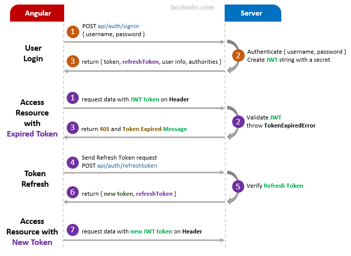

# Angular 10 Refresh Token example with JWT and Http Interceptor

You can take a look at following flow to have an overview of Requests and Responses that Angular 10 Client will make or receive.

## Angular JWT Refresh Token Flow


For more detail, please visit:
> [Angular 10 JWT Refresh Token example with Http Interceptor](https://www.bezkoder.com/angular-10-refresh-token/)

> [Angular 10 JWT Authentication with Web API](https://www.bezkoder.com/angular-10-jwt-auth/)

## Fullstack

> [Angular 10 + Spring Boot: JWT Authentication & Authorization example](https://www.bezkoder.com/angular-10-spring-boot-jwt-auth/)

> [Angular 10 + Node.js Express: JWT Authentication & Authorization example](https://www.bezkoder.com/node-js-express-angular-10-jwt-auth/)

Open `app/_helpers/auth.interceptor.js`, modify the code to work with **x-access-token** like this:
```js
...

// const TOKEN_HEADER_KEY = 'Authorization'; // for Spring Boot back-end
const TOKEN_HEADER_KEY = 'x-access-token';   // for Node.js Express back-end

@Injectable()
export class AuthInterceptor implements HttpInterceptor {
  ...

  private addTokenHeader(request: HttpRequest<any>, token: string) {
    /* for Spring Boot back-end */
    // return request.clone({ headers: request.headers.set(TOKEN_HEADER_KEY, 'Bearer ' + token) });

    /* for Node.js Express back-end */
    return request.clone({ headers: request.headers.set(TOKEN_HEADER_KEY, token) });
  }
}

...
```

Run `ng serve --port 8081` for a dev server. Navigate to `http://localhost:8081/`.

## More practice

> [Angular 10 CRUD application example with Web API](https://www.bezkoder.com/angular-10-crud-app/)

> [Angular 10 Pagination example | ngx-pagination](https://github.com/bezkoder/angular-10-pagination-example)

> [Angular 10 File Upload example with progress bar](https://www.bezkoder.com/angular-10-file-upload/)

Fullstack with Node.js Express:
> [Angular 10 + Node.js Express + MySQL](https://www.bezkoder.com/angular-10-node-js-express-mysql/)

> [Angular 10 + Node.js Express + PostgreSQL](https://www.bezkoder.com/angular-10-node-express-postgresql/)

> [Angular 10 + Node.js Express + MongoDB](https://www.bezkoder.com/angular-10-mongodb-node-express/)

Fullstack with Spring Boot:
> [Angular 10 + Spring Boot + MySQL](https://www.bezkoder.com/angular-10-spring-boot-crud/)

> [Angular 10 + Spring Boot + PostgreSQL](https://www.bezkoder.com/angular-10-spring-boot-postgresql/)

> [Angular 10 + Spring Boot + MongoDB](https://www.bezkoder.com/angular-10-spring-boot-mongodb/)

Fullstack with Django:
> [Angular 10 + Django Rest Framework](https://www.bezkoder.com/django-angular-10-crud-rest-framework/)

Integration (run back-end & front-end on same server/port)
> [How to Integrate Angular 10 with Node.js Restful Services](https://www.bezkoder.com/integrate-angular-10-node-js/)

> [How to Integrate Angular with Spring Boot Rest API](https://www.bezkoder.com/integrate-angular-spring-boot/)